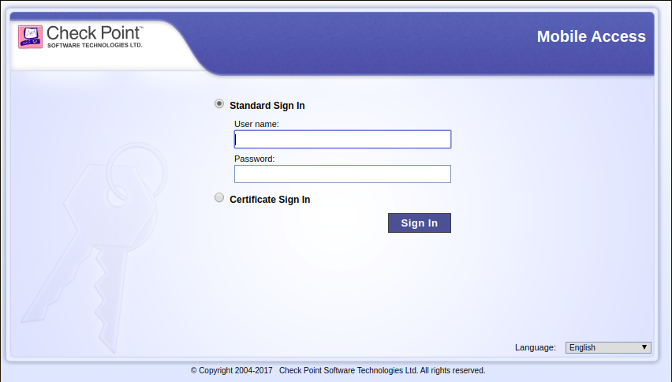
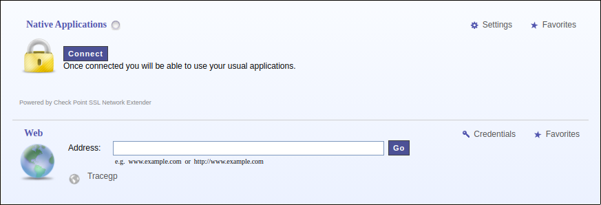
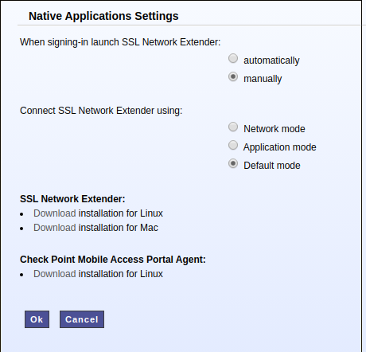

# Linux setup Checkpoint Mobile Access VPN

<div style="text-align:center">
    </img>
</div>

This is a step-by-step tutorial to setup your Linux machine with all the required dependencies to work with [Check Point Mobile Access VPN](https://www.checkpoint.com/products/mobile-access/). This tutorial also includes some troubleshooting.

## Introduction

In the past year I had to setup my Ubuntu 18.04 laptop twice. Both times were very exhausting and took long hours until it was ready to use due to so many different errors hard to find the solution on Google. So no need to mention this tutorial (at the current state) is only useful if you're working with a clean and recently installed Ubuntu LTS distro.

## Dependencies

First make sure your operating system is up-to-date with:

```bash
$ sudo apt-get update && sudo apt-get upgrade
```

Now you need some basic tooling for installing and building independent package vendors:

```bash
$ sudo apt-get install software-properties-common apt-transport-https wget curl
$ sudo apt-get install build-essential
```

### Java

If your system has no Java version installed, make sure you install the version 8 (or higher). You can do that quickly with [SDKMAN!](https://sdkman.io/), but first be sure you're on your home directory with:

```bash
$ cd ~
```

And then for installing SDKMAN!:

```bash
$ curl -s "https://get.sdkman.io" | bash
$ source "$HOME/.sdkman/bin/sdkman-init.sh"
```

List the available Java versions and try to find the OpenJDK version 8 or higher (in my case it was `8.0.232-open`) and then install it:

```bash 
$ sdk list java
$ sdk install java 8.0.232-open
```

### SSL

For the Check Point Mobile Access required packages, you'll need to install `xterm` and some SSL packages with the following commands:

```bash
$ sudo apt-get install xterm
$ sudo apt-get install libnss3-tools certutil
```

### 32 bit libs

If you're running a 64 bit operating system, you'll need to install some 32 bit compatible libraries:

```bash
$ sudo apt-get install libx11-6
$ sudo dpkg --add-architecture i386
$ sudo apt-get update
$ sudo apt-get install multiarch-support
$ sudo apt-get install libc6:i386 libncurses5:i386 libstdc++6:i386 libstdc++5:i386 libpam0g:i386
```

## Shell Scripts

There are two `sh` scripts you'll need to download to setup Check Point Mobile Access VPN on your machine:

- `snx_install.sh`
- `cshell_install.sh`

Both of them you can get on your company's Mobile Access VPN page.

### 1. Login

<div style="text-align:center">
    </img>
</div>


### 2. Click on "Settings" button
<div style="text-align:center">
    </img>
</div>

### 3. Click on "Download Installation for Linux" for both SSL Network Extender and Check Point Mobile Access Portal Agent
<div style="text-align:center">
    </img>
</div>

### 4.
