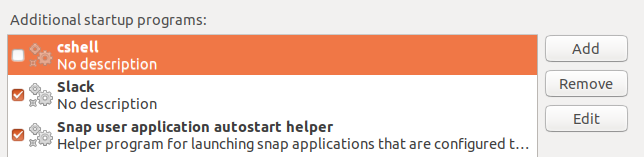

# Linux setup Check Point Mobile Access VPN

<p align="center">
    
</p>

This is a step-by-step tutorial to setup your Linux machine with all the required dependencies to work with [Check Point Mobile Access VPN](https://www.checkpoint.com/products/mobile-access/). This tutorial also includes some troubleshooting.

## Introduction

In the past year I had to setup my Ubuntu 18.04 laptop twice. Both times were very exhausting and took long hours until it was ready to use due to so many different errors hard to find the solution on Google. So no need to mention this tutorial (at the current state) is only useful if you're working with a clean and recently installed Ubuntu LTS distro.

## Dependencies

First make sure your operating system is up-to-date with:

```bash
$ sudo apt-get update && sudo apt-get upgrade
```

Now you need some basic tooling for installing and building independent package vendors:

```bash
$ sudo apt-get install software-properties-common apt-transport-https wget curl
$ sudo apt-get install build-essential
```

### Java

If your system has no Java version installed, make sure you install the version 8 (or higher). You can do that quickly with [SDKMAN!](https://sdkman.io/), but first be sure you're on your home directory with:

```bash
$ cd ~
```

And then for installing SDKMAN!:

```bash
$ curl -s "https://get.sdkman.io" | bash
$ source "$HOME/.sdkman/bin/sdkman-init.sh"
```

List the available Java versions and try to find the OpenJDK version 8 or higher (in my case it was `8.0.232-open`) and then install it:

```bash 
$ sdk list java
$ sdk install java 8.0.232-open
```

### SSL

For the Check Point Mobile Access required packages, you'll need to install `xterm` and some SSL packages with the following commands:

```bash
$ sudo apt-get install xterm
$ sudo apt-get install libnss3-tools certutil
```

### 32 bit libs

If you're running a 64 bit operating system, you'll need to install some 32 bit compatible libraries:

```bash
$ sudo apt-get install libx11-6
$ sudo dpkg --add-architecture i386
$ sudo apt-get update
$ sudo apt-get install multiarch-support
$ sudo apt-get install libx11-6:i386 libc6:i386 libncurses5:i386 libstdc++6:i386 libstdc++5:i386 libpam0g:i386
```

## Downloading the Shell Scripts

There are two shell script files you'll need to download to setup Check Point Mobile Access VPN on your machine:

- `snx_install.sh`
- `cshell_install.sh`

Both of them you can get on your company's Mobile Access VPN page.

### 1. Login

<p align="center">
    
</p>


### 2. Click on "Settings" button
<p align="center">
    
</p>

### 3. Click on "Download Installation for Linux" for both SSL Network Extender and Check Point Mobile Access Portal Agent
<p align="center">
    
</p>

## Running the Shell Scripts

The scripts you've just downloaded are just regular files. So we need to change their permissions to make them executable with the following commands:

```bash
$ chmod +x snx_install.sh
$ chmod +x cshell_install.sh
```

The first script we're going to run is the `snx_install.sh`, which should not give any errors when installing it.

```bash
$ ./snx_install.sh
Installation successfull
```

Here comes the tricky part: running the other shell script. The script will ask you for your password because it's going to run some things as `sudo`. Everything should be going fine until it gets to the last step: when it tries to run `/usr/bin/cshell/launcher`. That's where it gets stuck. This executable file does not work properly with `sudo`.

```bash
$ ./cshell_install.sh
Start Check Point Mobile Access Portal Agent installation
Extracting Mobile Access Portal Agent... Done
Installing Mobile Access Portal Agent... Done
Installing certificate... Done
Starting Mobile Access Portal Agent...
```

When you notice it is stuck at the message above, open Ubuntu's system monitor and try to find a process called `launcher` with 0% CPU usage and `Sleeping` status. Once you find it, kill it.

Do not ever type `CTRL+C` on the terminal or try to end its process or `launcher`'s. You must kill the `launcher` process. Otherwise, the script will do a clean-up and erase everything it has made that will allow you to make Check Point Mobile Access VPN work.

If you've done everything right, there should be an executable file called `launcher` at `/usr/bin/cshell/`. If so, run it and it should have been displayed some logs as follows:

```
$ /usr/bin/cshell/launcher
LAUNCHER> Starting CShell...
LAUNCHER> CShell Started
```

It means it has successfully been installed, and you should be fine trying to connect to the VPN now, but it doesn't mean we don't have more work to do.

## Troubleshooting

If you end up with an error when you're trying to run `/usr/bin/cshell/launcher` about a named pipe file called `cshell.fifo` inside the `/tmp` folder, just delete it with:

```bash
$ sudo rm /tmp/cshell.fifo
```

## Post-install

You need to disable one of your system's startup applications. You should be able to see one of them called `cshell` with a marked checkbox. All it does is running the `launcher` executable file in `/usr/bin/cshell/`. You must uncheck it because every time you let it run automatically it's going to be run as `sudo`, which means it's going to get stuck.

<p align="center">
    
</p>

Now we're going to do a little trick to make it start automatically without `sudo`: run it inside the `.bashrc` file, so every time you open up a terminal it's going to run with your user normal permissions. Actually, we only want to run it once when you log in, right? So why don't we simply run it inside `.profile`? Because everything in `.profile` run as `sudo`, so the `launcher` is going to get stuck.

So here is the tricky part: let's create a simple log file to check whether `launcher` should run every time you open up a terminal window. Add the following lines to the `.profile` file to remove the log file every time you log in.

```bash
if [ -f "/home/[MY-USER-NAME]/cshell_launcher.log" ]; then
    rm /home/[MY-USER-NAME]/cshell_launcher.log
fi
```

On the `.bashrc` file add the following lines to check whether it should run the `launcher` file every time you open up a terminal window:

```bash
if [ ! -f "/home/[MY-USER-NAME]/cshell_launcher.log" ]; then
    /usr/bin/cshell/launcher > /home/[MY-USER-NAME]/cshell_launcher.log
fi
```

Restart your computer, log into your user account and check if the log file we created is on your home directory by opening a terminal and typing:

```bash
$ ls | grep cshell
cshell_launcher.log
```

Then show its contents by using `cat` and it should be displayed as the following:

```bash
$ cat cshell_launcher.log 
LAUNCHER> Starting CShell...
LAUNCHER> CShell Started
```

Now you should be all set. Open your company's Check Point Mobile Access page and you should be able to connect everytime you log into your computer. Just remember to open up a terminal window first :)
